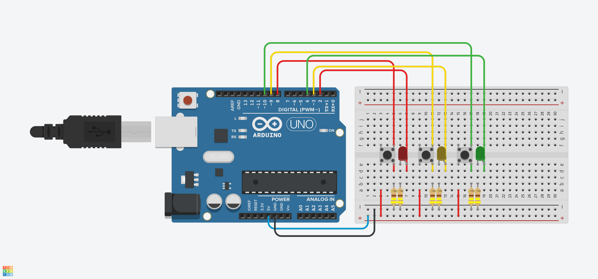

# 3LED-buttons-Circuit

This is a basic Arduino project where 3 buttons control 3 separate LEDs. Press a button, and the corresponding LED lights up.

## What's Inside

- `3LED_Buttons.ino` – the Arduino code
- `3LED_Buttons.brd` – the circuit board design file
- `3LED_Buttons.png` – a picture of the circuit

## How It Works

- Button 1 → LED 1  
- Button 2 → LED 2  
- Button 3 → LED 3

Each button turns on its matching LED when pressed.
